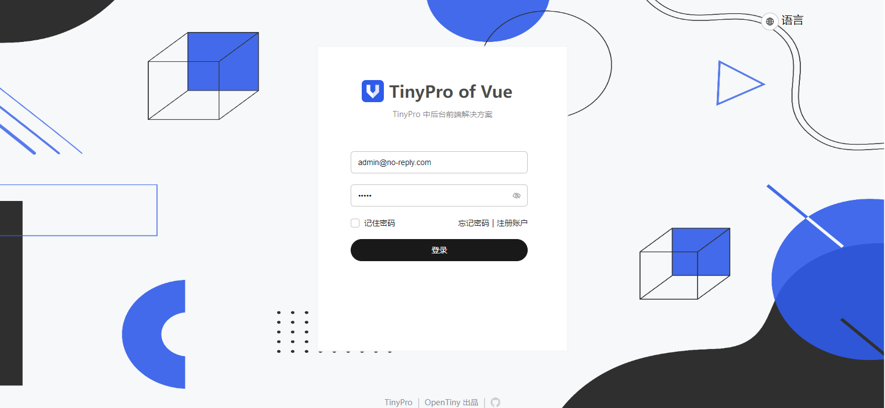

# TinyPro of vue3

## 视频教程

[OpenTiny社区](https://space.bilibili.com/15284299)

## 环境准备

请确保您安装了`nodejs`, `npm`, `tiny-cli`

```bash
tiny init pro
```

输入完成上述命令后，请根据指引输入您的信息

```
? 请输入项目名称： tiny-pro
? 请输入项目描述： 基于TinyPro套件创建的中后台系统
* 请选择您希望使用的客户端技术栈： vue
* 请选择您希望使用的服务端技术栈： Nest.js
* 请选择你想要的构建工具:  Vite
* 请确保已安装数据库服务（参考文档
https://www.opentiny.design/tiny-cli/docs/toolkits/pro#database）：
已完成数据库服务安装，开始配置
* 请选择数据库类型： MySql
* 请输入数据库地址： localhost
* 请输入数据库端口： 3306
* 请输入数据库名称： ospp-nest
* 请输入登录用户名： root
* 请输入密码： [hidden]
```

## 启动后端服务

请阅读[后端指南](./tiny-nest.md)

## 启动前端服务

```bash
# npm i
npm run start
```

出现下图即代表启动成功



## 结构

```
├─nestJs (后端)
│  ├─.env                 (环境变量)
│  └─src
│      ├─.generate
│      ├─auth             (鉴权接口)
│      ├─i18              (国际化接口)
│      ├─i18n             (后端国际化文件)
│      ├─menu             (菜单接口)
│      ├─permission       (权限接口)
│      ├─public           (公共文件)
│      ├─role             (角色接口)
│      └─user             (用户接口)
└─web                     (前端)
    ├─config
    │  ├─plugin
    │  └─utils
    ├─public
    └─src
        ├─api             (api管理)
        ├─assets          (静态资源)
        ├─components      (全局组件)
        ├─config
        ├─directive       (指令)
        ├─hooks           (通用钩子)
        ├─layout          (布局组件)
        ├─locale          (前端国际化文件)
        ├─mock            (静态资源)
        ├─router          (路由)
        ├─store           (全局状态管理)
        ├─types           (全局类型)
        ├─utils           (工具函数)
        └─views           (页面)
```

## 二次开发

### 菜单与路由

#### 路由

`tiny-pro`除了公共路由之外，其余路由均由后端生成一份特殊的数据结构，前端在`router/guard/menu.ts`下组合并动态添加。这样的好处是用户不会出现「闪现」问题

```ts
interface ITreeNodeData {
  // node-key='id' 设置节点的唯一标识
  id: number | string;
  // 节点显示文本
  label: string;
  // 子节点
  children?: ITreeNodeData[];
  // 链接
  url: string;
  //组件
  component: string;
  //图标
  customIcon: string;
  //类型
  menuType: string;
  //父节点
  parentId: number;
  //排序
  order: number;
  //国际化
  locale: string;
}
```

#### 路由

后端返回`ITreeNodeData`的数据结构后，前端将会在`router/guard/menu.ts`下`toRoutes`函数将`ITreeNodeData`转换为符合`vue-router`结构的数据结构，并动态添加。

#### 新增页面

`tiny-pro`的二次开发与普通的页面没有什么显著的差异。唯一的差异则是需要在`系统管理/菜单管理`下新建菜单，而后在`系统管理/角色管理`下为相应的用户绑定菜单即可

> 注：
>
>   优先级：菜单上下排列顺序，优先级越小，排列越靠近上方
>
>   父菜单ID：可选，选择当前已存在菜单作为父节点
>
>   组件：src/views下新增的组件，比如对src/views/board/home/index.vue组件，填写内容为board/home/index，截取views后的相对路径即可
>
>   路径：访问新增菜单的url，比如对src/views/board/home/index.vue组件，填写为board
>
>   国际化：为新增菜单选择对应的显示词条，若不存在合适词条，在“系统管理/国际化管理”中添加新词条即可

### 权限控制

权限控制由管理员在创建角色时分配角色，角色对应一个权限列表。当用户登录时，后端将会返回token，用户需要携带token请求自身信息与菜单(`ITreeNodeData`结构)。并通过`router/guard/menu.ts`中的`toRoutes`函数，将`ITreeNodeData`结构转为`vue-router`所需要的结构，并动态进行添加。

#### 组件级权限控制

> 组件级权限管理又称按钮级权限管理

`tiny-pro`对按钮级权限控制采用的是指令的方式，对于需要保护的组件只需要使用`v-permission="'<需要的权限>'"`即可。如果用户存在该权限，那么将会展示该组件，否则不会展示该组件。

### 国际化

`tiny-pro`除了登陆页面的国际化会在本地之外，其余国际化字段均需要使用`系统管理/国际化管理`进行添加。这么做的好处是可以很有效的减少产物的大小, 并且对于大型中后台而言, 可以使得国际化小组不与前端工程师产生耦合。

### 打包构建

目前`tiny-pro`支持`vite`, `webpack`, `rspack`三种打包方案（在初始化阶段任选其一）。只需要运行`npm run build`即可

## 遇到困难?

加官方小助手微信 opentiny-official，加入技术交流群

## 常见问题

### 跨域问题如何解决

对于开发环境来说，可以直接修改`dev-server`的`proxy`. 例如`vite`工具的`server.proxy`

### 代码无法提交

您可以选择移除husky或根据[Angular 规范](https://zj-git-guide.readthedocs.io/zh-cn/latest/message/Angular%E6%8F%90%E4%BA%A4%E4%BF%A1%E6%81%AF%E8%A7%84%E8%8C%83/)书写commit信息

### 页面部署后刷新404

请移步[Vue Router服务器部署指南](https://router.vuejs.org/guide/essentials/history-mode.html#Example-Server-Configurations)
